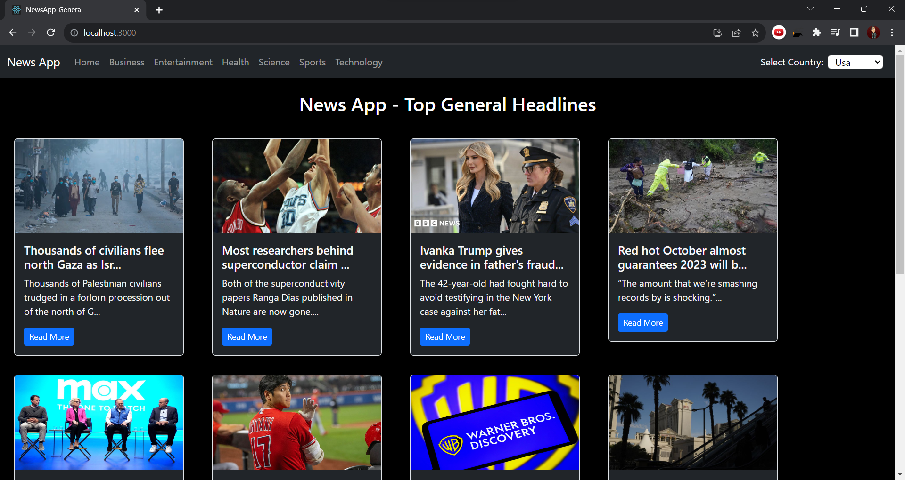

# News App

## Description
This is a news app that utilizes an API to fetch and display news articles. Users can browse news from various categories and filter the news based on their interests. The app is designed to provide a seamless experience for users to stay updated with the latest news across different topics.

## Features
- Fetches news articles from an API to ensure the latest and up-to-date information.
- Allows users to filter news articles based on different categories such as technology, sports, business, and more.
- Provides a user-friendly interface for easy navigation and a pleasant user experience.
- Enables users to read full articles by clicking on the Read more button.
- Users can select the country to view personalized news.
- Navigate seamlessly through articles: effortlessly browse previous and next news for a comprehensive understanding of evolving stories.

## Installation
1. Clone the repository to your local machine.
   ```
   git clone https://github.com/kumarkshitij171/News-App.git
   ```
2. Navigate to the project directory.
   ```
   cd News-App
   ```
3. Install the necessary dependencies.
   ```
   npm install
   ```

## Usage
1. Run the app using the following command.
   ```
   npm start
   ```
2. Open your preferred web browser and go to `http://localhost:3000` to access the news app.
3. Browse different news articles and use the category filters to refine your news feed.

## API
The app uses the following API to fetch news articles: [https://newsapi.org]

Certainly, here's the updated section for the README file, with instructions on how to obtain the API key:

## API Key
This app utilizes the News API to fetch news articles. You'll need to obtain an API key from [newsapi.org](https://newsapi.org) by following these steps:

1. Create an account on [newsapi.org](https://newsapi.org).
2. Once logged in, navigate to your account settings to find your unique API key.
3. Copy the API key and paste it into the designated field in the app's configuration.


## Technologies Used
- React.js
- HTML
- CSS
- Bootstrap

---
## Screenshots
